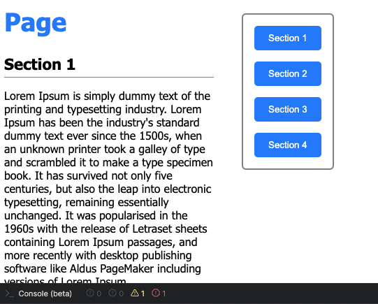
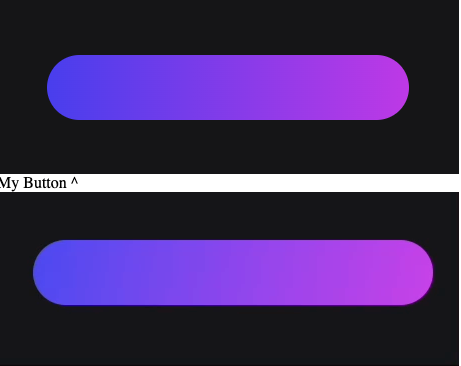
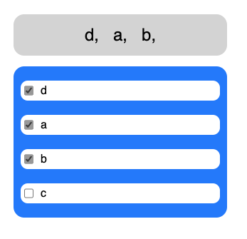
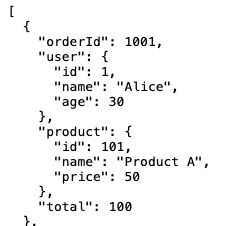

## Task 1 (Scroll To)
Your task is to implement scroll to section for buttons in the menu
Clicking on it should scroll your page to particular section
Section 1 using anchors as a solution, but your task is to make it without anchoring

#### Full JSFiddle Code: https://jsfiddle.net/vstoic/ua9e8sv7/64/

## Task 2 (Gradient Animation)
Your task is to implement animation for gradient on hover, video of how it should work attached
You can change any lines of code here and final result may vary from the example, its okay

#### Full JSFiddle Code: https://jsfiddle.net/vstoic/6npbq8xm/153/

## Task 3 (Multiselect)
Your task is to implement multiselect from scratch (styling is not required)
While closed it should show selected items separated by coma,
on click it should open a list where you can check/uncheck items

#### Full JSFiddle Code: https://jsfiddle.net/vstoic/zy8adj2v/175/

## Task 4 (Data Transform)
Your task is to implement generateOrderSummary function
TODO: it should generate summary for every order
so that response will look like this:
  {
  orderId: 1001,
  user: { id: 1, name: 'Alice', age: 30 },
  product: { id: 101, name: 'Product A', price: 50 },
  total: 100 price * quantity
  }
Additional (OPTIONAL) task
what is time complexity of your solution?
is it possible to make it in O(n) ?
rewrite your solution to be the fastest

#### Full JSFiddle Code: https://jsfiddle.net/vstoic/7h6fjprm/22/
